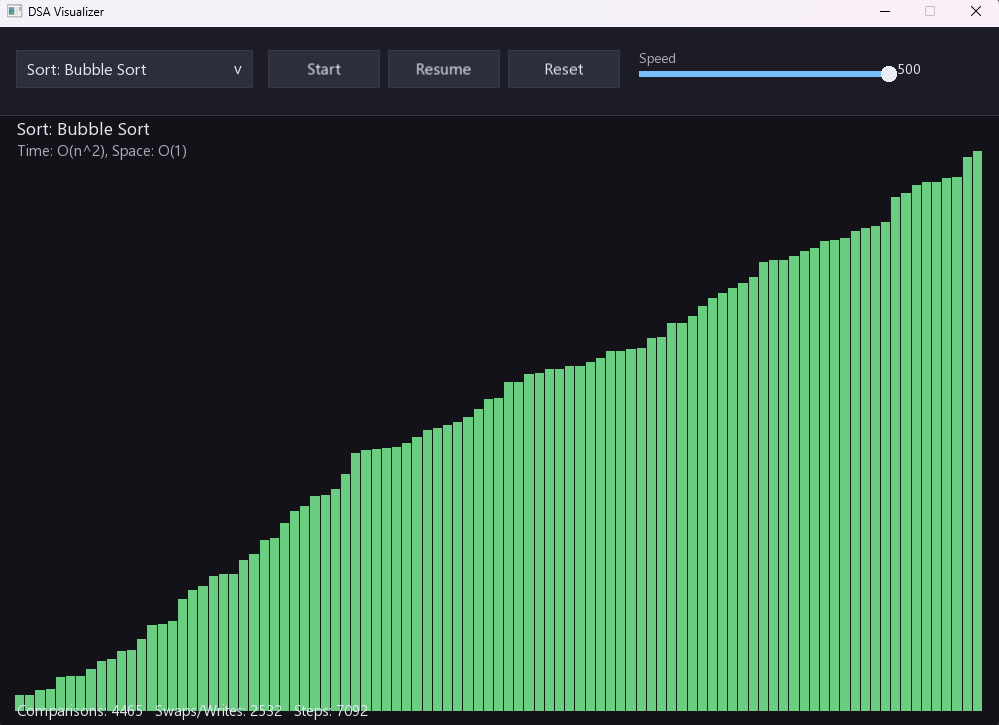
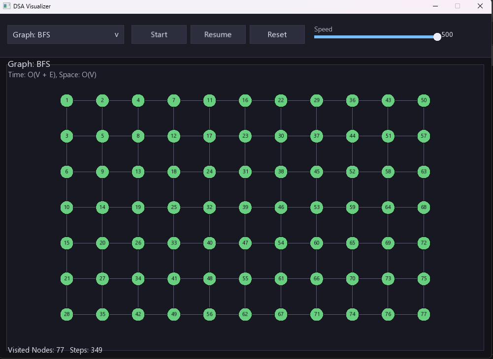

# 🧠 DSA Visualizer (C++ + SFML)

An interactive desktop application to visualize **Data Structures & Algorithms** in real-time using C++ and SFML.

---

## 🚀 Features

### 🔢 Sorting Algorithms

* Bubble Sort
* Selection Sort
* Insertion Sort
* Merge Sort
* Quick Sort

### 🌐 Graph Algorithms

* BFS (Breadth First Search)
* DFS (Depth First Search)
* Dijkstra’s Algorithm

---

## 🎨 UI & Visualization

* Dark modern UI (1000x700 window)
* Algorithm selection dropdown
* Start / Pause / Reset controls
* Real-time speed adjustment slider

### 🎯 Color Coding

* ⚪ Default → White
* 🟡 Comparing → Yellow
* 🔴 Swapping/Writing → Red
* 🟢 Sorted → Green

---

## 📊 Stats Panel

* Sorting:

  * Comparisons
  * Swaps / Writes
  * Steps

* Graph:

  * Visited Nodes
  * Steps

* Dynamic time complexity display

---

## ⚙️ Key Highlights

* Non-blocking animation loop (smooth UI)
* Step-by-step algorithm visualization
* Modular and clean C++ architecture
* Built with modern C++ (C++17)

---

## 📁 Project Structure

```
dsa-visualizer/
  main.cpp
  CMakeLists.txt
  visualizer/
  algorithms/
  ui/
  utils/
  assets/
```

---

## 🛠️ Tech Stack

* C++
* SFML (Graphics)
* CMake

---

## ⚡ Build & Run

### 🔹 Using CMake (Recommended)

```bash
cmake -S . -B build
cmake --build build
```

Run:

```bash
build/DSAVisualizer
```

### 🪟 Windows (Release mode)

```bash
cmake -S . -B build
cmake --build build --config Release
.\build\Release\DSAVisualizer.exe
```

---

## 📦 Dependencies

### SFML Installation

#### 🪟 Windows (Recommended)

Use vcpkg:

```bash
vcpkg install sfml
```

Then:

```bash
cmake -S . -B build -DCMAKE_TOOLCHAIN_FILE=C:/path/to/vcpkg/scripts/buildsystems/vcpkg.cmake
```

---

#### 🐧 Linux (Ubuntu/Debian)

```bash
sudo apt update
sudo apt install -y libsfml-dev
```

---

## 🔤 Font Handling

The application loads fonts in this order:

1. `assets/Roboto-Regular.ttf`
2. `assets/Inter-Regular.ttf`
3. System fonts (Segoe UI, Arial)

If no font is found, the app exits with an error message.

---

## 📸 Demo

## 📸 Screenshots

### 🔢 Sorting Visualization


### 🌐 Graph Visualization


---

## 💡 Future Improvements

* Sound effects for sorting
* More graph algorithms
* UI enhancements and animations
* Export visualization as video

---

## 👨‍💻 Author

Mallikarjun Kudalli

---

## ⭐ If you like this project

Give it a ⭐ on GitHub!

